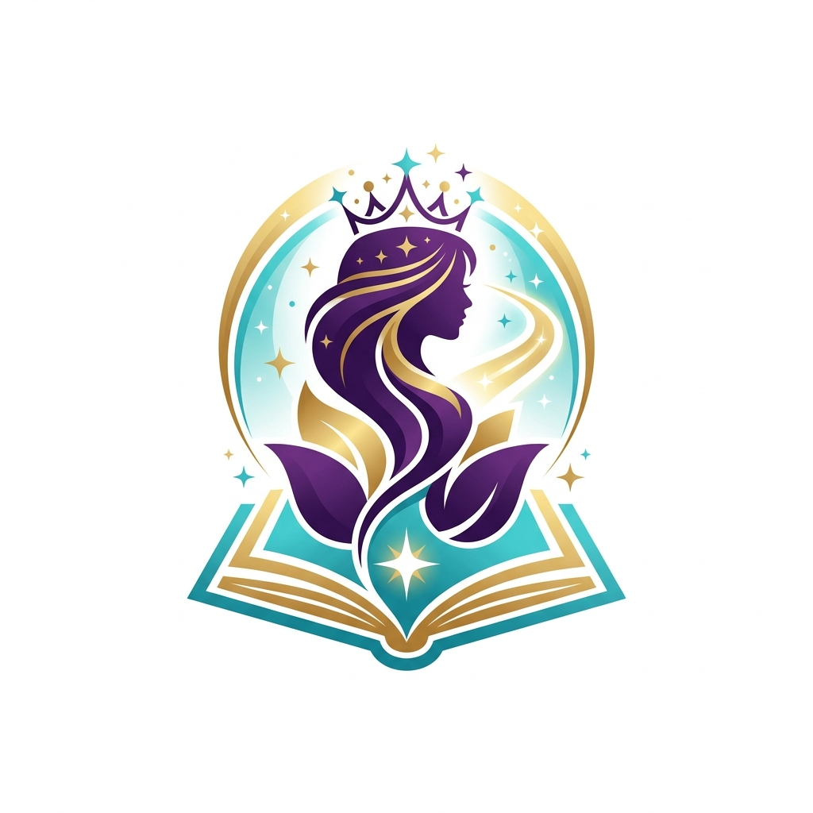

# Sultana - Le Parcours des Droits
## Documentation Complète : Cahier des Charges & Charte Graphique

---

# I. Cahier des Charges Fonctionnel et Technique

## 1. Présentation du Projet
**Sultana - Le Parcours des Droits** est une application web éducative immersive et mobile-first conçue pour les jeunes filles marocaines de moins de 18 ans. L'objectif est de les sensibiliser à leurs droits à travers une expérience ludique, narrative et interactive.

## 2. Objectifs du Projet
- **Éduquer** : Transmettre des connaissances sur les droits fondamentaux de manière accessible.
- **Engager** : Utiliser le storytelling et la gamification pour maintenir l'intérêt de l'utilisateur.
- **Inspirer** : Créer un univers "magique" et moderne qui valorise l'utilisateur.
- **Accessibilité** : Garantir une expérience fluide sur mobile, même avec une connexion limitée.

## 3. Public Cible
- **Utilisatrices principales** : Jeunes filles marocaines (12-18 ans).
- **Contexte d'utilisation** : Smartphone, usage personnel ou éducatif.
- **Langue** : Français (avec possibilité d'adaptation en Arabe/Darija).

## 4. Spécifications Fonctionnelles

### 4.1. Écran d'Accueil
- Présentation de l'univers Sultana.
- Bouton d'action principal (CTA) pour commencer l'aventure.
- Musique d'ambiance désactivable.

### 4.2. Sélection des Univers
L'aventure est divisée en plusieurs étapes (univers) thématiques :
1. **Éducation & Savoir** (Thème Bleu/Indigo)
2. **Santé & Bien-être** (Thème Vert/Émeraude)
3. **Protection & Sécurité** (Thème Rose/Violet)
4. **Futur & Ambition** (Thème Doré/Ambre)

### 4.3. Système de Jeu (Storytelling)
- Dialogue narratif avec Sultana ou d'autres personnages.
- Choix multiples impactant le déroulement ou apportant des informations.
- Système de feedback immédiat après chaque décision (didactique).

### 4.4. Conclusion & Récompense
- Résumé du parcours effectué.
- Message d'encouragement final.
- Possibilité de recommencer ou de partager son score/parcours.

## 5. Spécifications Techniques

### 5.1. Stack Technologique
- **Frontend** : React 19, TypeScript.
- **Routing** : TanStack Router.
- **Styling** : Tailwind CSS 4.
- **Animations** : Framer Motion.
- **Icônes** : Lucide React.

### 5.2. Performance & Optimisation
- Temps de chargement minimal.
- Optimisation des assets (images WebP).

### 5.3. Accessibilité
- Respect des contrastes (WCAG AA).
- Typographie lisible (16px+).

---

# II. Charte Graphique

## 1. Identité Visuelle & Logo
Le logo de Sultana incarne la sagesse, l'élégance et le pouvoir de l'éducation.

## 2. Palette de Couleurs

### Couleurs Principales (Brand)
- **Violet Sultana** : `#6D28D9`
- **Or Royal** : `#F59E0B`
- **Turquoise Éclat** : `#06B6D4`

### Thèmes des Univers
| Univers | Couleur Dominante |
| :--- | :--- |
| **Éducation** | Bleu Indigo (`#312E81`) |
| **Santé** | Vert Émeraude (`#059669`) |
| **Protection** | Rose Fuchsia (`#DB2777`) |
| **Futur** | Ambre Doré (`#D97706`) |

## 3. Typographie
- **Titres** : Outfit (Moderne & Élégant)
- **Corps de texte** : Inter (Lisible & Professionnel)

## 4. Éléments d'Interface (UI)
- **Boutons** : Radius 12px, Gradients légers.
- **Cartes** : Glassmorphism (Backdrop blur).
- **Icônes** : Outline, 2px stroke (Lucide React).
